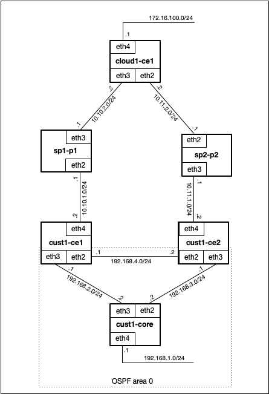

# GoBGP Practical Activity
### Task description
You have the following topology:



All devices have bird pre-installed.

The Customer has AS number 64512.
The ISP1 has AS number 64601 and the ISP2 has AS number 64602.
The Cloud Provider has AS number 64700.

The objective is to configure routing policies on cust1-ce1, cust1-ce2 and cloud1-ce1 devices to ensure that forwarding path
cust1-core<->cust1-ce1<->sp1-p1<->cloud1-ce1 will be used as a primary and path cust1-core<->cust1-ce2<->sp2-p1<->cloud1-ce1 
will be used as a secondary path if path1 is not available.

eBGP sessions must be configured between:
- cust1-ce1 and sp1-p1;
- cust1-ce2 and sp1-p2;
- sp1-p1 and cloud1-ce1;
- sp2-p1 and cloud1-ce1;

iBGP session must be configured between cust1-ce1 and cust1-ce2.

OSPF must be configured between cust1-ce1, cust1-ce2 and cust1-core.


#### 1. Setup Vagrant
Download from https://www.vagrantup.com/downloads.html and install
#### 2. Pull repository
```git clone https://github.com/ivanlysogor/bird-bgp-ospf```
#### 3. Setup environment
```
cd bird-bgp-ospf
vagrant up
```
#### 4. Configure routing policies

Configure BGP routing policies to achieve required behavour.

Hints:
- you can connect to your virtual routers with command ```vagrant ssh <router-name>```
- Bird documentation available at https://bird.network.cz/
- Bird aliases (work for root user):
  - bc - edit bird configuration file
  - bl - show syslog tail
  - br - send SIGHUP signal to bird daemon (reload configuration)
- Bird console available with "birdc" command


#### 5. Validate

Run traceroute between internal cust1-core IP address (192.168.11.11) and internal cloud1-ce1 IP address (172.16.100.11) to ensure that traffic goes through cust1-ce1 and sp1-p1 devices. Test it for opposite direction traffic as well.

Disable sp1-p1 device and ensure that IP connectivity restored throught sp2-p1 device.

#### 5. Destroy VM
```vagrant destroy```
